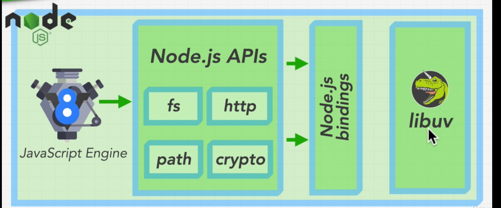

### Node fundamental internal

-   What Node.js includes
-   
-   Node internals deep dive
-   Node.js souce code on Github
-   libeuv internals deep dive
-   Official libuv website
-   Synchronous vs Asynchronous
-   Asynchronous callbacks
-   Non-blocking input & Output 
-   Exercise is javascript Asynchronous
-   Multi-treading, Processes, and Threads
-   Is Node.js Multi-treaded
-   the event loop
-   Callback Queues
-   Phases of the Event loop
-   The event loop in detail
-   Comparing Node With PHP and Python
-   What Is Node.Js Best AT
-   Observer design Pattern
-   The Node vent emitter
-   The Node events Module
-   Recommended Path Asynchronous javascript 